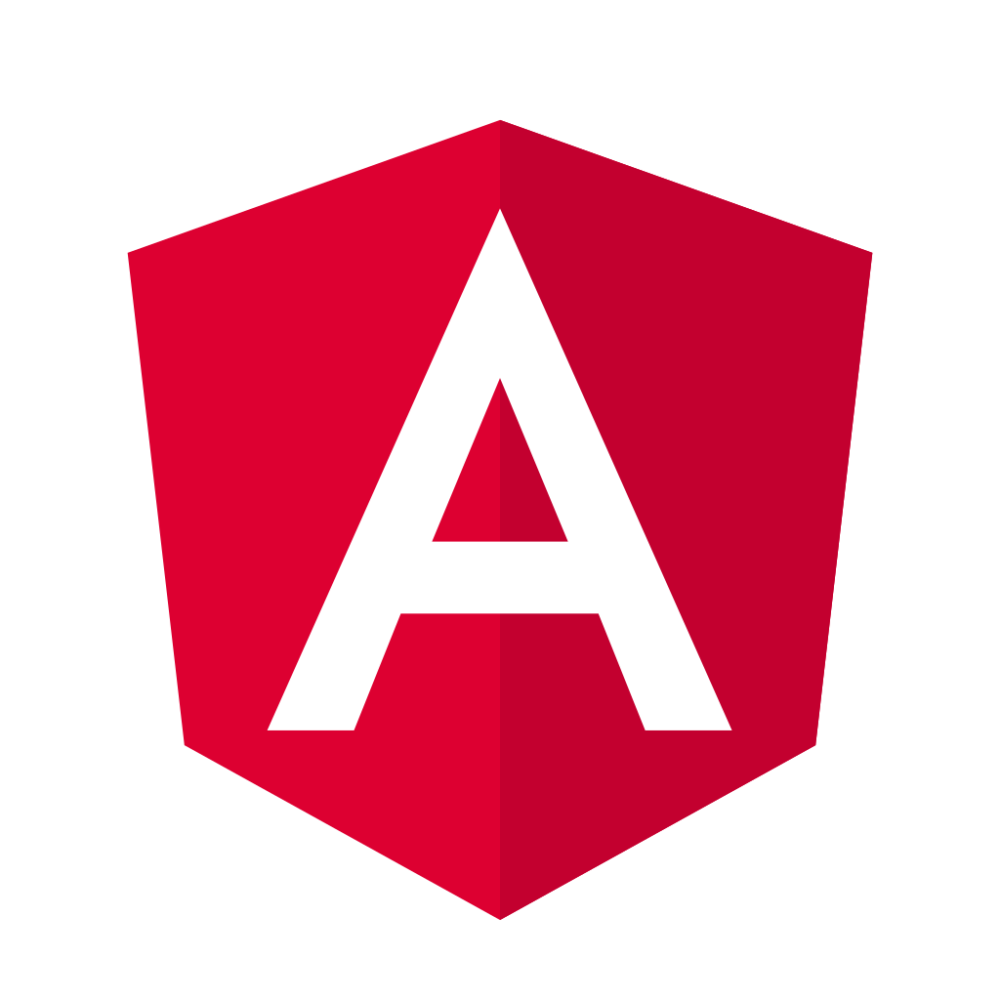

# Welcome to Myop.js

## Introduction
Welcome to the official GitHub organization of Myop.dev (myopjs)! 
Our mission is to revolutionize UI development by providing tools that allow developers to build user interfaces once and modify them on the fly, without the need for redeployment. 
With Myop, you can achieve unparalleled flexibility and control over your application's UI/UX.

## What is Myop?
Myop is an innovative meta-framework & developer platform that transforms how user interfaces and experiences are built, managed, and deployed.
It offers full control over UI/UX remotely and in real-time while the code is running.
Myop makes web applications entirely flexible, allowing for remote interface updates with built-in A/B testing, segmentation, and personalization capabilities.

## Key Features
 - **Runtime UI Control**: Modify and manage UI components remotely at runtime without touching the core codebase or redeploying.
 - **Built-in A/B Testing**: Experiment with different UI variations seamlessly to determine the most effective designs.
 - **Segmentation and Personalization**: Tailor the user experience based on specific user segments, enhancing engagement and satisfaction.
 - **Framework Agnostic**: Designed to work with any web application, regardless of the framework used.
 - **Open-Source SDKs**: Our SDKs connect your application logic with dynamically chosen user interfaces, simplifying UI/UX experimentation without deployments.

## Getting started

|  |  |                                                                                         |
|:---------------------------------------------------------------------:|:--:|:--------------------------------------------------------------------------------------------------------------------------------------------------------------:|
| [React Usage Examples](https://github.com/myopjs/react-myop-demos) | [Vue Usage Examples](https://github.com/myopjs/vue-myop-demos) | [Angular Usage Examples](https://github.com/myopjs/angular-myop-demos)  [Angular + NX Usage Examples](https://github.com/myopjs/angular-myop-demos-nx) |

For detailed documentation and examples, please visit our official website.

## Community and Support
Join our growing community to stay updated, ask questions, and share your experiences:

- Visit our [Website](https://www.myop.dev)
- Explore the [Dev Center](https://docs.myop.dev)
- Follow our [LinkedIn](https://www.linkedin.com/company/myop-dev)
- Join the [Discord Server](https://discord.com/invite/vxgD7AyXhM)
- or contact us [by Mail](mailto://contact@myop.dev)

We welcome contributions and feedback from the community.
If you're interested in contributing, let's talk.
